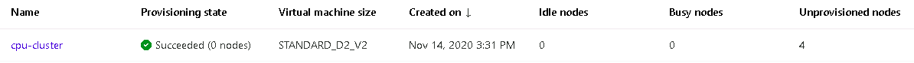

# Optimizing an ML Pipeline in Azure

## Overview
This project is part of the Udacity Azure ML Engineer Nanodegree.
In this project, I built and optimize an Azure ML pipeline using the Python SDK and a provided custom Scikit-learn model.

The model building was in two parts, the first part, I created an Azure ML pipeline using Hyperdrive to choose the optimal hyperameters of a Scikit-learn logistic regression model.

The second part, I configured and run an Azure AutoML model on the same dataset and the best model chosen.

The two models were compared to see which one performed better, interms of accuracy.

>**[Logistic Regression + Hyperdrive] vs [Azure Auto ML]**

>****Hyperdrive:*** is a python package that automates the process of choosing the best hyperparameters for your machine learning model.*

## Summary
The dataset contains 32,950 observations of a direct marketing campaign of a Portuguese banking institution. Each of the observations corresponds to an individual customer information.

### Attribute Information:

**Input variables:**
1. age (numeric)
1. job : type of job (categorical: 'admin.','blue-collar','entrepreneur','housemaid','management','retired','self-employed','services','student','technician','unemployed','unknown')
1. marital : marital status (categorical: 'divorced','married','single','unknown'; note: 'divorced' means divorced or widowed)
1. education (categorical: 'basic.4y','basic.6y','basic.9y','high.school','illiterate','professional.course','university.degree','unknown')
1. default: has credit in default? (categorical: 'no','yes','unknown')
1. housing: has housing loan? (categorical: 'no','yes','unknown')
1. loan: has personal loan? (categorical: 'no','yes','unknown')
1. contact: contact communication type (categorical: 'cellular','telephone')
1. month: last contact month of year (categorical: 'jan', 'feb', 'mar', ..., 'nov', 'dec')
1. day_of_week: last contact day of the week (categorical: 'mon','tue','wed','thu','fri')
1. duration: last contact duration, in seconds (numeric). Important note: this attribute highly affects the output target (e.g., if duration=0 then y='no'). Yet, the duration is not known before a call is performed. Also, after the end of the call y is obviously known. Thus, this input should only be included for benchmark purposes and should be discarded if the intention is to have a realistic predictive model.
1. campaign: number of contacts performed during this campaign and for this client (numeric, includes last contact)
1. pdays: number of days that passed by after the client was last contacted from a previous campaign (numeric; 999 means client was not previously contacted)
1. previous: number of contacts performed before this campaign and for this client (numeric)
1. poutcome: outcome of the previous marketing campaign (categorical: 'failure','nonexistent','success')
1. emp.var.rate: employment variation rate - quarterly indicator (numeric)
1. cons.price.idx: consumer price index - monthly indicator (numeric)
1. cons.conf.idx: consumer confidence index - monthly indicator (numeric)
1. euribor3m: euribor 3 month rate - daily indicator (numeric)
1. nr.employed: number of employees - quarterly indicator (numeric)

**Output - Target variable:**
1. y - has the client subscribed a term deposit? (binary: 'yes','no')

As seen above the dataset has 20 features and one binary target variable y. We seek to predict if the client will subscribe a term deposit(y).

**In 1-2 sentences, explain the solution: e.g. "The best performing model was a ..."**

The solution to this problem is a binary classification model capable of predicting the class `yes` or `no` if the client will subscribe `a term deposit(y)`. The best performing model was a `VotingEnsemble` model by the Azure AutoML run with an Accuracy of `0.91721`. This outperformed the logistic regression model optimized by `Hyperdrive`.

## Scikit-learn Pipeline
**Explain the pipeline architecture, including data, hyperparameter tuning, and classification algorithm.**

The pipeline for this process consisted of two different setups:

### Logistic Regression + Hyperdrive Setup

1. A python `train.py` script which contains data ingestion code from a url csv data is setup to create a Tabular dataset.
b. Within the same script, data cleansing and a Scikit-learn Logistic Regression model is also setup.

1. A notebook which contains the Hyperdrive configuration settings is setup to call the `train.py` script for model training and hyperdrive hyperparameter optimization.

1. In the notebook, the hyperdrive configuration when set to run, submits its process and executes the process on an Azure ML compute cluster. 

1. The execution of this process imports the data from a url csv data, creates a tabular dataset, cleanse the dataset and split into train test sets.

1. The training data is parsed together with the configured hyperparameter values to the Scikit-learn Logistic Regression model.  

1. The model is trained on the different combination of hyperameter values specified. The trained model is evaluated on the test data and Hyperdrive creates several Logistic Regression models based on the combination of some selected hyperdrive hyperparater values specified. Their accuracy are logged.

1. The best Logistic Regression model with the highest accuracy is then saved.

### AutoML Setup
1. The AutoML run is setup in the same Notebook using the same dataset.

1. A Tabular Dataset is created from the URL csv data.

1. The dataset is cleansed and split into train test sets.

1. The training data and the test data are uploaded to Azure datastore and registered as a dataset within the same workspace previously used by hyperdrive run.

1. The training configuration code is setup and the task is set to `classification`. The training dataset and the label (dependent variable) specified.

1. A Compute target is specified, kfold `n_cross_validation` value is set, and `primary_metric` is chosen as `accuracy`.
1. The AutoML run is submitted to execute on the same compute cluster used previously.

1. AutoML run generates different machine learning models by picking different algorithms and different hyperparameters.

1. The best model from AutoML run is chosen and saved.

**What are the benefits of the parameter sampler you chose?**

Random Parameter Sampling was chosen as the Hyperparameter tuning algorithm. The benefit of this search algorithm is that it provides a good model by randomly selecting hyperparameter values from a defined search space. This makes it less computational intensive and much faster. It also supports early stoping policy.

**What are the benefits of the early stopping policy you chose?**

It's early stoping policy is beneficial because it terminates low performance runs to pave way for runs that can produce good results.

## AutoML
**In 1-2 sentences, describe the model and hyperparameters generated by AutoML.**

AutoML generated close to about 28 different models and the best model with the highest accuracy is chosen. AutoML chooses the hyperparameters automatically for all the different algorithms used.

## Pipeline comparison
**Compare the two models and their performance. What are the differences in accuracy? In architecture? If there was a difference, why do you think there was one?**

The best model `VotingEnsemble` produced by AutoML outperformed the `Logistic Regression + Hyperdrive` model. The accuracy of AutoML's `VotingEnsemble` was `0.91721` and that of the `Logistic Regression + Hyperdrive` was `0.9144`. 

There was a slight difference in the performance and this was due to the fact that different Machine Learning Algorithms, different data transformations were used in AutoML in combination with different hyperparameter optimization techniques. Whereas, in the `Logistic Regression + Hyperdrive` model only used a single algorithm with a single hyperparameter technique without any data transformation.

## Future work
**What are some areas of improvement for future experiments? Why might these improvements help the model?**

For future experiments data transformation techniques could be leverage in combination with logistic regression and hyperdrive to see if there is an improvement in its performance.

I would also try different hyperdrive hyperparameter search algorithms such as `GridParameterSampling` or `BayesianParameterSampling` for performance improvement.

The last but not the least I would use different algorithms with in combination with different hyperdrive hyperparameter configurations.

## Proof of cluster clean up
The delete method `aml_compute.delete()` can be found in the .ipynb code.

